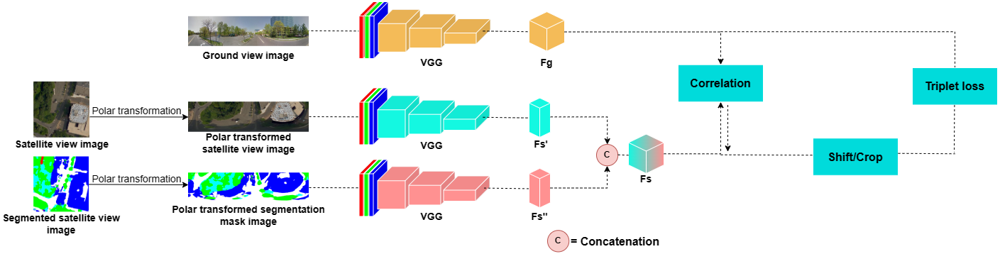

# A Semantic Segmentation-guided Approach for Ground-to-Aerial Image Matching

<p>This refers to "A Semantic Segmentation-guided Approach for Ground-to-Aerial Image Matching". It procudes our results on a subset of the CVUSA dataset.</p>

## Abstract
<p align="justify">Nowadays the accurate geo-localization of ground-view images has an important role across different domains, including journalism, forensics analysis, and Earth Observation. This work addresses the problem of matching a query ground-view image with the corresponding satellite image without GPS data. This is done by comparing the features from a ground view image with a satellite one together with its segmentation mask through a three-stream Siamese-like network. The proposed method focuses on limited Field-of-View (FoV) and ground panorama images (images with a FoV of 360°). The novelty is in the fusion of satellite images in combination with their segmentation masks, aimed at ensuring that the model can extract features and focus on the significant parts of the images. This work shows how the proposed model through semantic segmentation mask images improves the performance on the unlabelled CVUSA dataset on all the tested FoV.</p>

## Model 


## Requirements
1. This code uses TensorFlow 2.10.0 and numpy 1.25.2, with a modern GPU of at least 6GB of memory
2. We ram the code with Python 3.9.2
3. Download the used CVUSA subset at the following link: 

## Steps
- Clone the repository 
    - ```git clone https://github.com/pro1944191/SemanticAlignNet```
- For training run the following command:
    ```
    python train_no_session.py --train_grd_noise 360 --train_grd_FOV $YOUR_FOV --test_grd_FOV $YOUR_FOV
    ```
    - This command will run the python ```file train_no_session.py```, inside the file there are other possible parameters to pass as input or to leave as default value
    - ```$YOUR_FOV``` chose a value bewteen 0 and 360, that is the FoV value used for the ground view images

## Starting from the paper code:
Starting from the ```train_cvusa.py```, it includes the two VGG16 network:
- VGG.py for the ground images
- VGG_cir.py for the satellite images

After setup the sessions and some other parameters the main functioning is that when training the batch is generated from the class function next_pair_batch() for the training and next_batch_scan() (file Polar_Input_Data_Orien_3.py)for the testing phase. Then the tf.session calls the function VGG_13_conv_v2_cir() (cir_net_fov.py file) where passing the ground and satellite features, they are correlated, shifted and cropped, returning a distance vector used to compute the loss or the accuracy in the testing phase.

To tun the file run the following command for training :
```sh
python train_cvusa_fov.py --train_grd_noise 360 --train_grd_FOV $YOUR_FOV --test_grd_FOV $YOUR_FOV
```
- train_grd_noise 360: means that the FOV cutting is done randomly (to simulate an orientation unknown)
- train_grd_FOV and test_grd_FOV for selecting the FOV of ground images for training and testing

For testing:
```sh
python test_cvusa_fov.py --train_grd_noise 360 --train_grd_FOV $YOUR_FOV --test_grd_FOV $YOUR_FOV
```

## About my code:
The functioning is the same, the difference is that both the VGGs are contained in the file VGG_no_session.py, and I created differents Polar_Input_Data_Orien_3.py files based on the preferred test. 
To simulate the original paper code use Polar_Input_Data_Orien_3.py, VGG_no_session.py and cir_net_fov_mb.py.
The command to run files is the same as before, but usually I change the input parameters manually.
